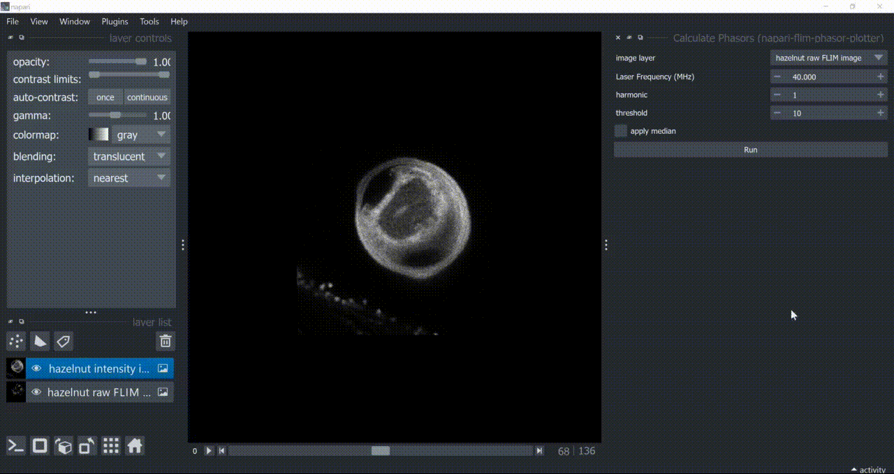

# Segmenting an example FLIM image with the phasor plot in napari

- Open the hazelnut 2D, hazelnut 3D or the synthetic lifetime cat sample data from the napari-flim-phasor-plotter under `File > Open Sample > napari-flim-phasor-plotter`

- Calculate the phasor plot under `Plugins > napari-flim-phasor-plotter > Calculate Phasors`

- Manually select clusters with the mouse and check the segmentation results on the main canvas.

- Re-calculate the phasor plot exploring other parameters (median, harmonic, threshold) to improve clusters display in the phasor plot.

