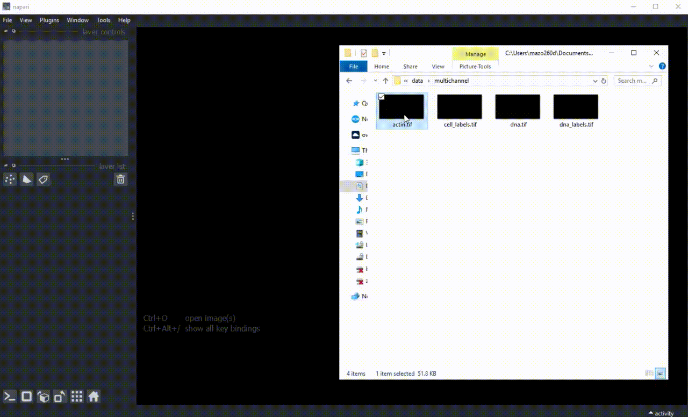
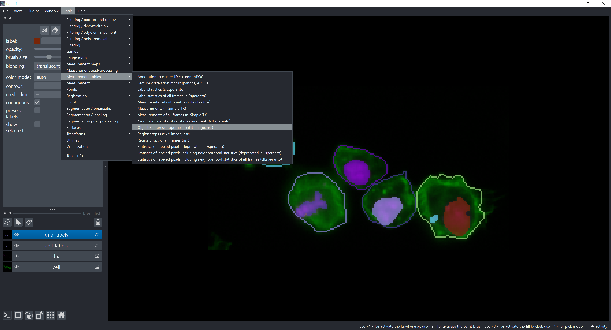
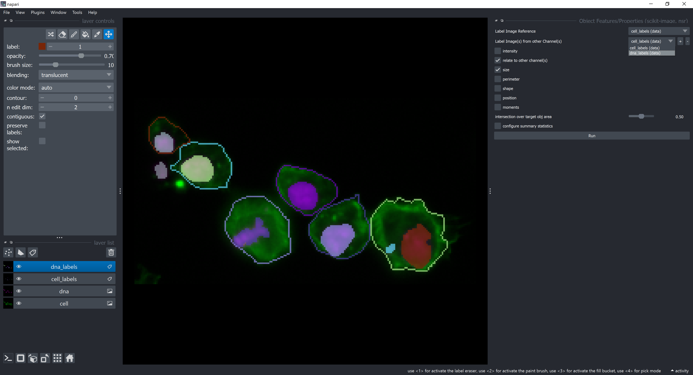
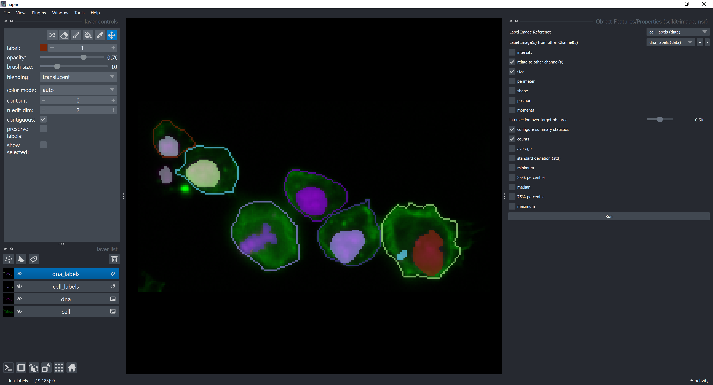
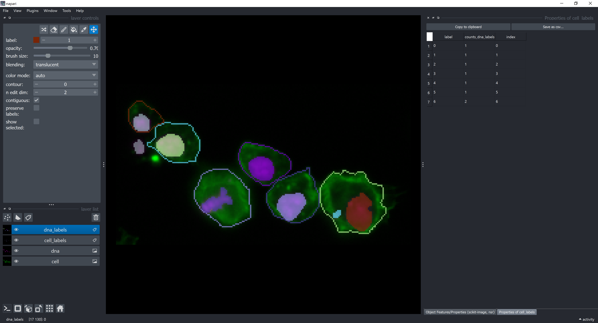
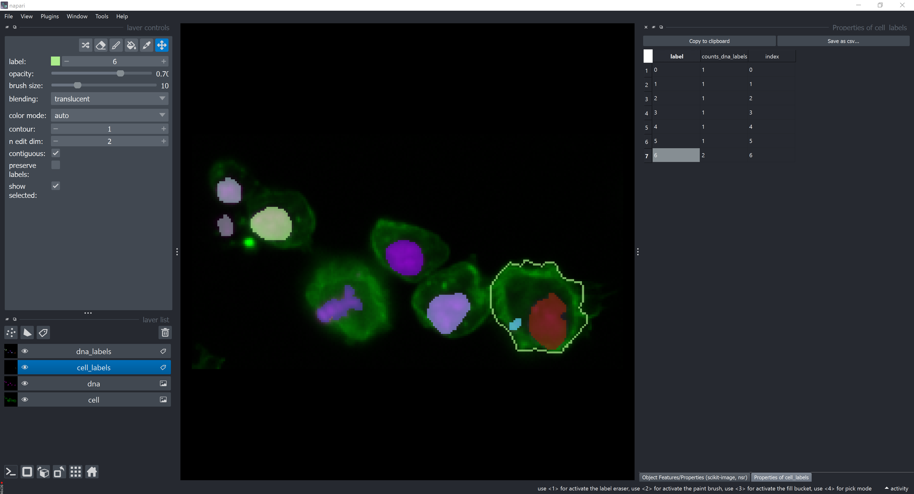
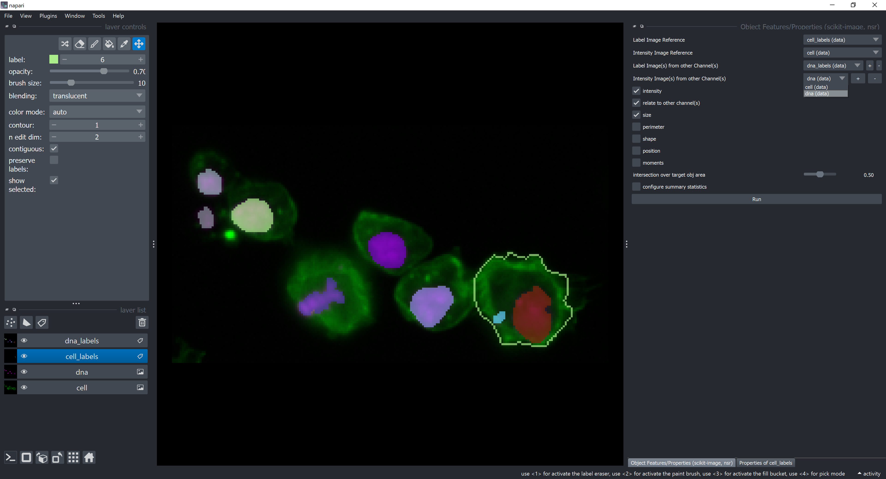
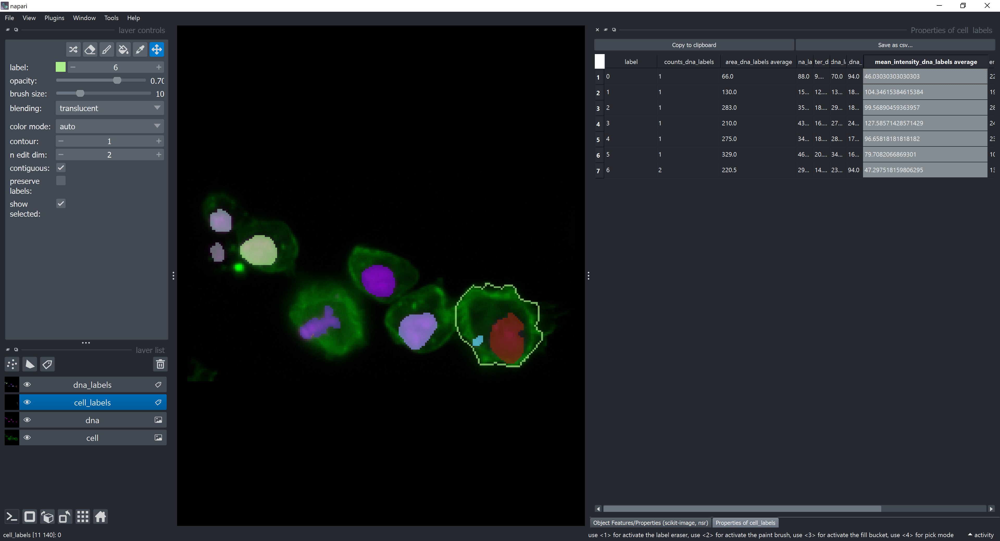

# Multichannel Analysis in Napari

In this exercise we will perfom [Feature Extraction](https://focalplane.biologists.com/2023/05/03/feature-extraction-in-napari/) and relate features to objects in different channels in napari. We will use the napari plugin [napari-skimage-regionprops](https://github.com/haesleinhuepf/napari-skimage-regionprops?tab=readme-ov-file#napari-skimage-regionprops-nsr).

## Getting started

Open a terminal window and activate your conda environment:

```
mamba activate napari-intro-env
```

Afterwards, start up Napari:

```
napari
```

Open the following images in napari, which can be found in the `data/multichannel` folder of this repository ([here](https://github.com/BiAPoL/BioImage-Analysis-and-Data-Processing-Workshop-2024/tree/main/data/multichannel)):
- actin.tif (cells)
- dna.tif
- cell_labels.tif
- dna_labels.tif

Change the blending mode of the `actin` and `dna` layers to `additive` and adjust the colormap of the `actin` layer to `green` and the `dna` layer to `magenta`.



We will start by extracting features of the `dna_labels` objects in respect to the `cell_labels` objects (reference). To do that, click on Tools -> Measurement tables -> Object Features/Properties 
 


The feature extraction widget should open. Check the `relate to other channel(s)` checkbox and a new dropdown menu should appear. Select `dna_labels` in the new dropdown menu.



Now, let's configure which summary statistics to show. Click on the checkbox `configure summary statistics` and select `counts` and unselect `average` checkboxes. This means we want to count how many objects from the `dna_labels` layer are contained by each object in the `cell_labels` layer. Click on `Run`.



A new table should appear with the summary statistics.



The label column contains the ids (labels) of each cell object in the `cell_labels` layer. The `counts_dna_labels` column contains the number of objects from the `dna_labels` layer that are contained by each cell object in the `cell_labels` layer. Below is a highlight for the cell label number `6`, which is the only one containing more than one object. Label `0` refers to the background.



Now, let's add some intensity measurements. Click on the `intensity` checkbox and select the `actin` image layer in the `Intensity Image Reference` dropdown menu and the `dna` image layer in the `Intensity Image(s) from other Channel(s)`. 



Click on `configure summary statistics` and select back the `average` checkbox. Click on `Run`. A new table should appear with more columns than before. They represent average of `dna` features contained by each cell. For example, the average of the `mean_intensity` feature of `dna` elements contained by each cell is displayed in the column `mean_intensity_dna_labels_average`.



This table can be saved as a `.csv` file by clicking on the `Save as csv...` button.