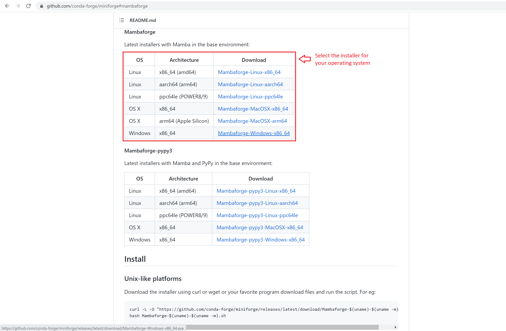
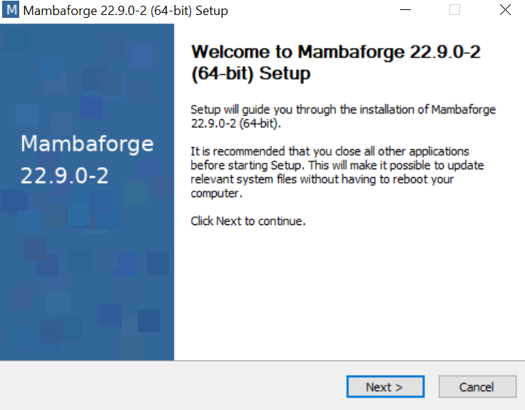
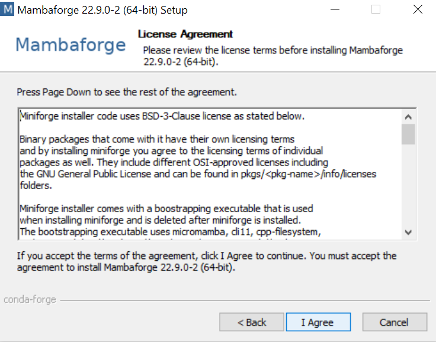
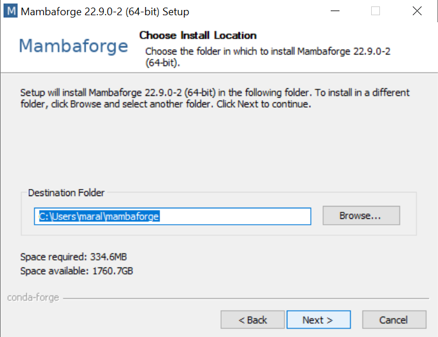
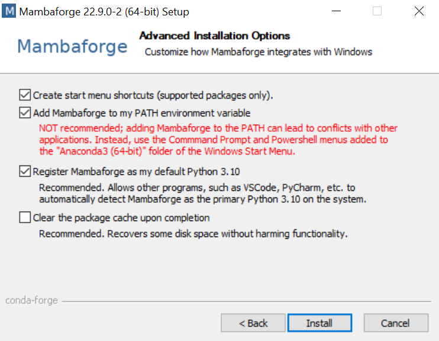
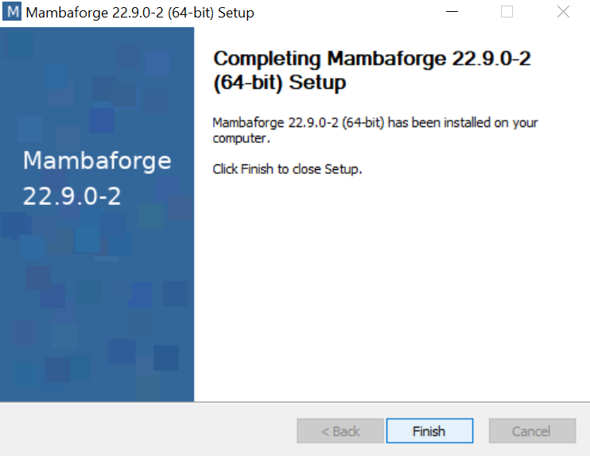
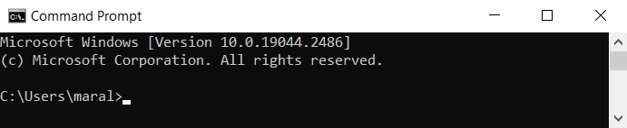
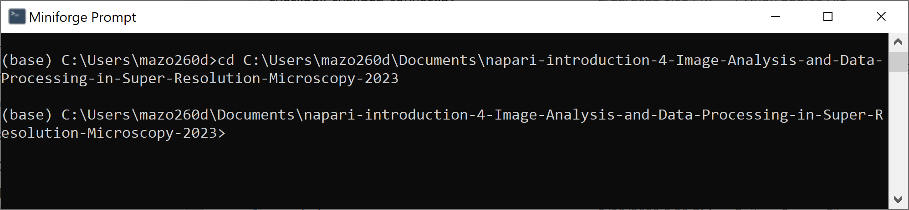
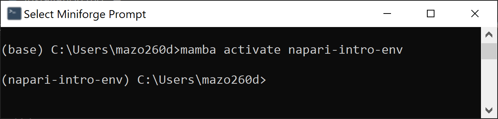

# Getting started with Mambaforge and Python 
From blog post written by [Mara Lampert](https://biapol.github.io/blog/mara_lampert/readme.html) on January 26th, 2023

## Introduction to Python and Mamba 
This blog post explains what Python and [Mamba](https://mamba.readthedocs.io/en/latest/installation.html)/ Mambaforge, and how you can download and setup it on your computer. We will also go through some steps how to get started with Bio-image Analysis. 

> **_Note:_** This is an update of a [previous Blogpost](https://biapol.github.io/blog/johannes_mueller/anaconda_getting_started/) written by Johannes. 


**Why do we need Mamba to use Python?**

__Python__ is a programming language which is easy to learn and very important in scientific data analysis nowadays. 

__Mamba__ is a __package manager__ which can be used with Python. It is a software allowing to install other software. Read more about Mamba [here](https://focalplane.biologists.com/2022/12/08/managing-scientific-python-environments-using-conda-mamba-and-friends/). 

## Installation of Mambaforge 
Here, I am going to show how to install Mambaforge. It comes with everything you need and downloads it from a community-driven open source software provider called  [conda-forge](https://conda-forge.org/). 
First, you pick the Mambaforge installer for your operating system [here](https://github.com/conda-forge/miniforge#mambaforge):



All Mac OS users can now jump [here](#installation-on-mac-os).

### Installation on Windows
When Mambaforge finished downloading, follow these steps during the installation: 

Click `Next`:



Click `I Agree`:



Now you have the option to either install Mambaforge for `Just Me` or for `All Users`. We highly recommend picking `Just Me`, as the other option requires Administrator priviledges and it can make installing packages more difficult later on.


Install Mambaforge into the default location:


 
In the next step we recommend to additionally tick `Add Mambaforge to my Path`. If you don’t add it to the [Path](https://janelbrandon.medium.com/understanding-the-path-variable-6eae0936e976), Conda and Mamba would not work from any Terminal Window. Click `Install`



Click `Next` at the next window and you arrive here. Click `Finish` to exit the setup:



Great! You are ready to start coding! 👍 
To see how to use Mambaforge, jump [here](#using-mambaforge)

### Installation on Mac OS

First, you open your Terminal. You can find it using the Spotlight Search and typing _Terminal_ like this:


The opened Terminal should look like this: 


Then type these two lines to start the installation

```json
curl -L -O "https://github.com/conda-forge/miniforge/releases/latest/download/Mambaforge-$(uname)-$(uname -m).sh"
```

```json
bash Mambaforge-$(uname)-$(uname -m).sh
```

You  just follow the instructions, press `Enter` and type _yes_ like here:


When you see this:


you are finished! Close and reopen the Terminal now. Happy coding! 👍

## Using Mambaforge 

Now we use Mambaforge by opening the command line. If you are not familiar with the command line yet, you can check out Roberts tutorial [here](https://www.youtube.com/watch?v=MOEPe9TGBK0&t=1146s). 

To open the Command Prompt in Windows, press the `Windows button`, type _cmd_ and press `Enter`. The Mac OS users should already know how to open the Terminal ;-)

When you open the command line, it should look like this: 



You are now located in the base environment. It is the default environment and includes beside a Python installation the core Conda libraries and dependencies.

> **_Strong recommendation:_** Never install any packages into the base environment! 

The reason for this is that incompatibilities between packages can occur. Robert demonstrated this [here](https://focalplane.biologists.com/2022/12/08/managing-scientific-python-environments-using-conda-mamba-and-friends/). If this happens in any environment apart from the base environment it is no problem. You can delete the environment, recreate it and start again. If this happens in the base environment, you need to delete and reinstall Mambaforge. 

## Downloading the course material

In order to have the course material locally in your computer, you should clone this repository. An easy way to do that is by downloading it as a `.zip` file, uncompressing it and storing the folder inside in a known location. The picture below shows how to do that.


## Creating a new environment  for the course
For this course, we will create an environment based on setting given by a `.yml` file. So, open the Command Prompt and navigate to where you stored this course material (to navigate to different folders with the Command Prompt, use the command `cd` followed by the absolute path of the folder), for example, if you stored in the Documents folder, type:

```json
cd C:/Users/Marcelo/Documents/napari-introduction-4-Image-Analysis-and-Data-Processing-in-Super-Resolution-Microscopy-2023
```

You will notice that the next line will contain your curent path, like this.



Now, type the following command to create a conda environment based on a `.yml` file in this folder:

```json
mamba env create -f environment.yml 
```

This will create a new environment with the name `napari-intro-env` and with Python version 3.9 installed. Furthermore, the latest version of necessary python packages will be installed in this environment, too, including napari and some napari plugins.

Conda will ask you about your permission to download the needed packages with `Proceed [y]/n`. By hitting `Enter` you confirm this and mamba will download and install the necessary packages. 

> **_Recommendation:_** Create one conda environment for every project you are working on. This allows you to keep an overview on the needed packages for the project, maintaining them and ensure compatibility of the packages. 

To activate the environment, type: 
```json
mamba activate napari-intro-env
```
This should lead to the prefix napari-intro-env appearing at the beginning of the command line: 



## Starting napari 

Now you can open napari, just type:
```json
naparia 
```

The opened window in napari should look like this and show the [napari-assistant](https://github.com/haesleinhuepf/napari-assistant), a panel with common image processing operations.


## Deactivation or Deletion of an environment 
If you want to deactivate the environment you just need to type: 
```json
mamba deactivate 
```
If you screwed up your environment and want to delete it, you can type:
```json
mamba env remove -n nameofproject_env
```

---

Now you have Mambaforge installed, know how to work with conda environments and know about some very important packages. Have fun starting your own Bio-image Analysis project! 👍

---